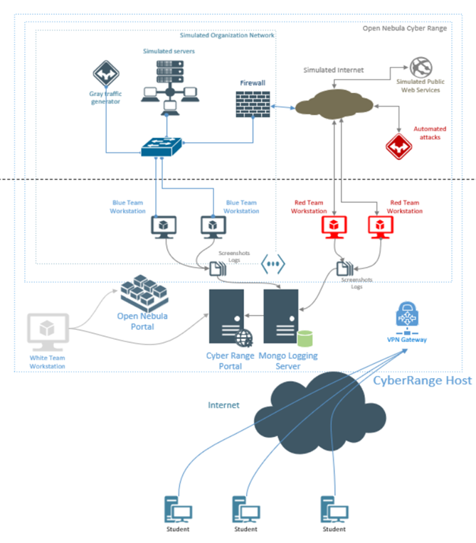

Реализиране на функционалност за изграждане на сесии към
виртуални системи в Cyber Range, и извличане на артефакти от провеждането
на обучения.

 

Съръвр - ProLiant DL360 G7

CR представлява затворена виртуална среда, в рамките на която могат да се симулира комплексната ИТ инфраструктура на организация, както и частична, ограничена функционалност на Интернет сайтове и глобални услуги като Интернет търсачка, социални мрежи, DNS системи и др.Тези виртуализирани среди позволяват симулирането на цялостни сценарии на информационна атака и защита. В рамките на виртуализираната среда действията на участниците ( както атакуващи, така и защитаващи се ) могат да бъдат наблюдавани и оценявани, а сценарият на действията променян, така че да се усвоят необходимите умения. CR като виртуализирана среда може да служи освен за обучение и за разработване или тестване на продукти в сферата на киберсигурността, като се използват възможностите за автоматизация и симулация.

https://drive.google.com/file/d/1Af6NjYxEpJZI6ls8_43oaRVy5Jau9XnZ/view?usp=sharing
